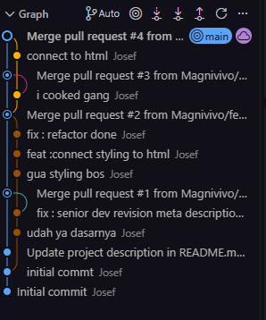

# git_ready_test_anying
gua gabut

# 🍣 BNCC Sushi — Authentic Binusian Sushi

> "Fresh, authentic sushi made daily with the finest chips." — dan tentu saja, **Never Open**. 🔒

Sebuah website homepage restoran sushi fiksi bertema teknologi/meme developer, dibuat untuk latihan kolaborasi Git & GitHub (branching, pull request, code review, dan merge).

## 📸 Visualisasi



## 🛠️ Tech Stack

- **HTML5** — struktur halaman, semantic HTML (nav, footer, section)
- **CSS3** — styling tema gelap, CSS Custom Properties, responsive design
- **JavaScript (Vanilla)** — easter eggs, interaksi DOM, console games
- **Git & GitHub** — version control, branching, pull request, code review

## ✨ Fitur Utama

- **Menu Meme Tech** — menu sushi bertema developer: 404: Salmon Not Found, Ctrl+Alt+Delight Roll, Miso Soup.exe, It Works On My Machine Roll
- **Tema Gelap Tech Vibe** — dark mode dengan palet warna brand (skala Blue, Green, Yellow) menggunakan CSS custom properties
- **Responsive Design** — layout menyesuaikan untuk layar mobile (media query)
- **Easter Eggs**:
  - Ketik "sushi" di keyboard → hujan emoji 🍣🥢🍥
  - Judul tab berubah saat pindah tab ("come back, the salmon is escaping")
  - Sapaan berdasarkan waktu (git lunch --force)
  - Kartu "404: Salmon Not Found" benar-benar melakukan 404 saat diklik
  - Klik harga 3x → unlock BNCC Sushi Premium™ ($$$99.99/mo, no refunds)
  - Klik footer "Never Open" 10x → achievement + hujan sushi
- **Console Experience** — boot sequence, fake git log, dan deteksi DevTools

## 👥 Contribution

| Anggota | Kontribusi |
|---------|------------|
| Magnivivo | Struktur HTML homepage, konten menu meme, setup repository |
| Magnivivo | Stylesheet lengkap dengan tema tech gelap & palet warna brand |
| Magnivivo | Refactor HTML/CSS: wrapper .card menggantikan sibling selector |
| Magnivivo | JavaScript easter eggs & integrasi JS ke halaman |

saya fullstack

## 📚 What I Learned

- jujur gk ada gwe ambil hikmah aja wkwkw...

## 🚀 Feature Improvement

- [ ] Multi-page — halaman About, Contact, dan detail menu
- [ ] Sistem pemesanan — form order dengan validasi JavaScript (checkout tetap Never Open 🔒)
- [ ] Dark/Light mode toggle — memanfaatkan CSS custom properties yang sudah ada
- [ ] Filter kategori menu dan pencarian
- [ ] Deploy dengan GitHub Pages + CI/CD — auto-deploy setiap merge ke main
- [ ] Accessibility audit — screen reader dan keyboard navigation
```

**Langkah pakai:**
1. Pastikan Git sudah terinstall di komputer Anda. Jika belum, download di git-scm.com

2. Buka Terminal (Linux/Mac) atau PowerShell/CMD (Windows)
  Clone repository ini dengan perintah:
  -git clone https://github.com/Magnivivo/git_ready_test_anying.git

3. Masuk ke folder project:
  -cd git_ready_test_anying
     
4. Buka file index.html di browser Anda:
  Klik 2x file index.html, atau
  Ketik perintah berikut:
   - start index.html     # Windows
   - open index.html      # Mac
   - xdg-open index.html  # Linux
